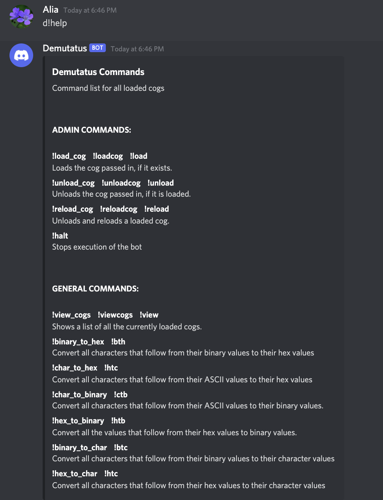
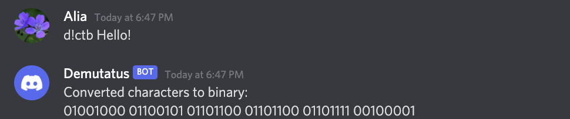

# Demutatus

### What is Demutatus?
Demutatus is a bot that works with the popular chatting and gaming application Discord.
It makes use of the Discord.py API so that you can interact with Demutatus in your server to easily do conversions 
between binary, hexadecimal, and characters. The best part of Demutatus is that it is scalable! You can
add cogs with other functionalities to increase the usefulness of Demutatus for your server.

### How do I use Demutatus?
If you are in a server that is already set up with Demutatus, simply use the command ```d!help``` 
to view an embed containing the commands that are available to use! If you would like to use this
bot in a server that it is not currently in, you will need to host it locally using the steps
[listed here](https://discordpy.readthedocs.io/en/stable/discord.html).

Once you have created your bot and obtained its token, download the code in this repository
and add a file (on the same level as demutatus.py) named bot_token.py. Inside this file, put:
```TOKEN = YOUR TOKEN HERE``` replacing "YOUR TOKEN HERE" with the token you've obtained.

### What does that look like?
Below are some samples of a user interacting with the bot.


The user calls the help embed using hte ```d!help``` command.



The user uses ```d!ctb``` to convert "Hello!" from character to binary.

If you have any questions, comments, or suggestions for demutatus, please email me at [aalram@outlook.com](aalram@outlook.com).